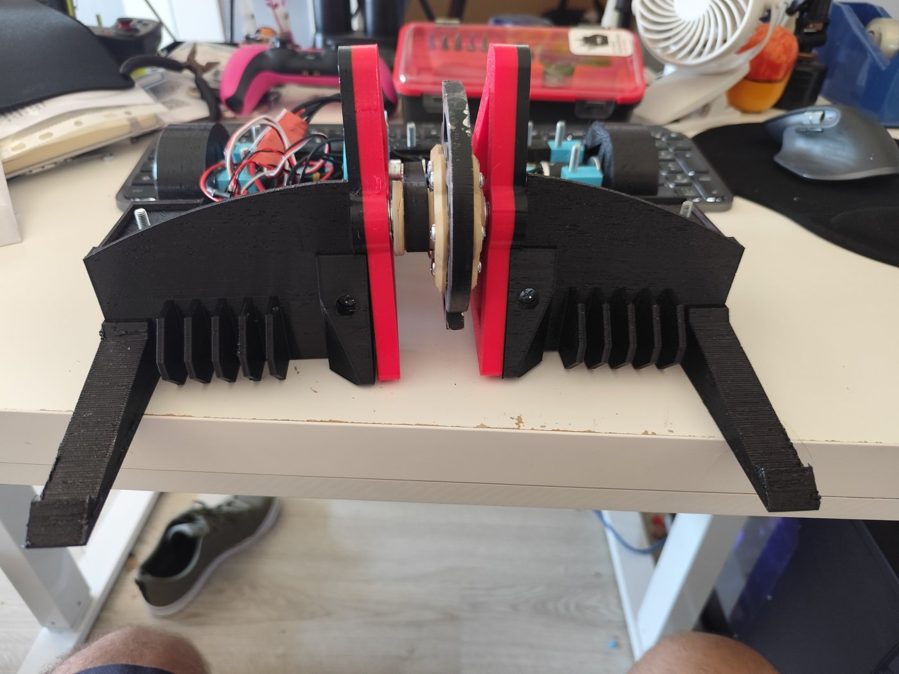

# 🤖 Driller

**Driller** é um robô de combate da classe **Beetleweight (1,5 kg)** com arma do tipo **vertical spinner**, construído para competir na [Liga REC – Robot Extreme Competition](https://robotextreme.pt).

<p align="center">
  
</p>

## 📍 Estado atual

| | |
|---|---|
| **Estado** | 🛠️ Em construção |
| **Versão atual** | V3 |
| **Próximo evento** | LGW (Lisboa Games Week) |
| **Peso** | Por confirmar na balança (limite: 1500 g, sem tolerância) |
| **Combates registados** | Ainda nenhum |

## 📐 Ficha técnica

| Item | Detalhe |
|---|---|
| Categoria | Beetleweight (1500 g) |
| Locomoção | Rodas (rolling), 2 motores |
| Arma | Vertical spinner (disco) |
| Motor da arma | RS2205 2300KV brushless |
| Motores de tração | 2× NEEBRC 2322 3500KV brushless + caixa redutora planetária 24 mm 16:1 |
| ESC da arma | ESC 30A com firmware AM32 |
| ESCs de tração | 2× ESC 20A com firmware AM32 (1 por motor, modo bidirecional) |
| Distribuição e interruptor | Placa de distribuição REC Lite, com interruptor por parafuso |
| Bateria | LiPo 3S 450 mAh |
| Rádio | HotRC |
| Chassis | Peças impressas em 3D; base em fibra de carbono 3 mm ou policarbonato 4 mm |

## 🧩 Lista de peças

| Peça | Modelo | Qtd | Peso unit. (g) | Preço unit. (€) | Fornecedor |
|---|---|:-:|:-:|:-:|---|
| Motor da arma | RS2205 2300KV brushless (CW/CCW) | 1 | ~30 | 6,10 | AliExpress |
| ESC da arma | ESC 30A AM32 | 1 | — | — | — |
| Motores de tração | NEEBRC 2322 3500KV brushless | 2 | ~50 | 15,00 | AliExpress |
| Caixas redutoras | Planetária 24 mm, 16:1 | 2 | ~45 | 15,00 | [Robot Extreme](https://robotextreme.pt) |
| ESCs de tração | ESC 20A AM32 | 2 | — | — | — |
| Placa de distribuição | REC Lite (interruptor por parafuso) | 1 | — | — | [Robot Extreme](https://robotextreme.pt) |
| Parafusos | DIN 7985 PZ M5×45 | — | — | — | INTEC |
| Parafusos | DIN 7985 PZ M4×16 | — | — | — | INTEC |
| Porcas | DIN 985 nyloc M5 | — | — | — | INTEC |

> Pesos marcados com `~` são estimativas, ainda por confirmar na balança.

## 🔄 Versões

O robô já passou por três iterações de design, cada uma na sua pasta:

| Versão | Período | Destaques nos ficheiros |
|---|---|---|
| **V1** | mar.–mai. 2026 | Primeira base e laterais, jantes e moldes para pneus, polia GT2 80T, tampa superior e proteção traseira |
| **V2** | jun.–jul. 2026 | Transmissão com carretos (motor/roda), novo disco da arma, suportes do disco com e sem rolamento, base em DXF para corte, proteções laterais e traseiras |
| **V3** ⭐ | set. 2026 | Versão atual: escudos frontais, jante com pneu integrado, laterais v2, novo topo e traseira, modelo 3D completo (`Driler V3.glb` / `.obj`) |

<p align="center">
  
  
</p>
<p align="center"><em>À esquerda: render da V3. À direita: render da V2.</em></p>

## 📁 Estrutura do repositório

```
Driller/
├── V1/                            # Peças da 1.ª versão (STL)
├── V2/                            # Peças da 2.ª versão (STL, DXF, G-code, renders)
├── V3/                            # Versão atual (STL, G-code, renders, modelo 3D GLB/OBJ)
├── ESCs/                          # Firmware e configuração dos ESCs AM32
│   ├── AM32_GD32DEV_B_E230_2.20.hex
│   └── configuracoes_am32_config.ecf
├── akk-rs2205-2300kv-1.snapshot.1/  # Modelo 3D do motor RS2205 (STEP, F3D)
└── docs/                          # Imagens do README
```

## ⚡ ESCs (AM32)

Os ESCs usam firmware **AM32**:

- `ESCs/AM32_GD32DEV_B_E230_2.20.hex`: firmware AM32 v2.20 para ESCs com MCU GD32 (target `GD32DEV_B_E230`).
- `ESCs/configuracoes_am32_config.ecf`: configuração guardada com o AM32 Configurator.

Os ESCs de tração estão em modo bidirecional, para o robô andar para a frente e para trás. O ESC da arma roda num só sentido.

## 🛣️ Próximos passos

- [ ] Pesar todas as peças e confirmar a margem até aos 1500 g
- [ ] Melhorar o acesso à bateria sem ser preciso tirar toda a tampa superior
- [ ] Tornar o robô mais compacto
- [ ] Comparar os ESCs atuais com os B-CUBE AM32 45A (aquecimento e tamanho)

## 🏁 Competição

O Driller compete na **Liga REC**, na classe Beetleweight: 1500 g com a bateria instalada, sem tolerância. O robô é pesado na inspeção e antes de cada combate, e cada combate dura 3 minutos. Mais informação em [robotextreme.pt](https://robotextreme.pt).
